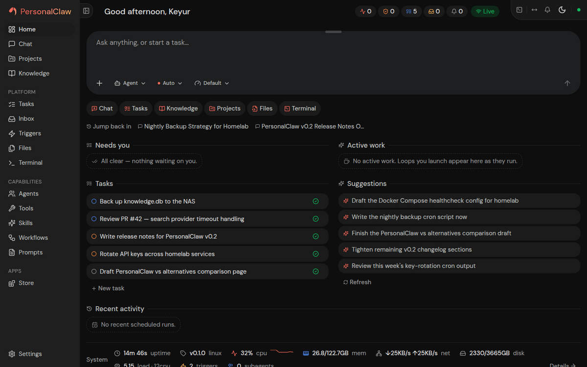
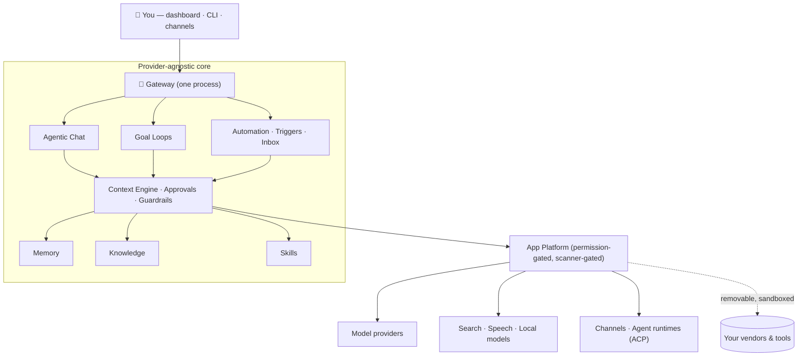
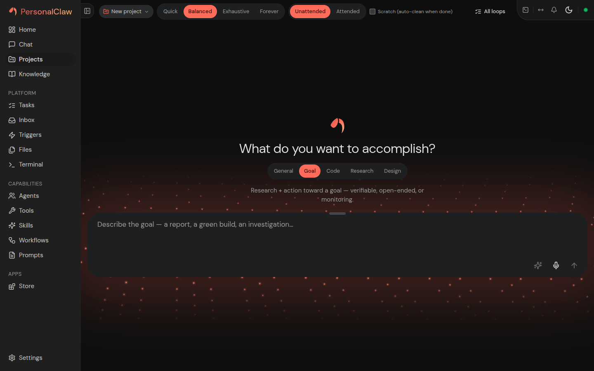
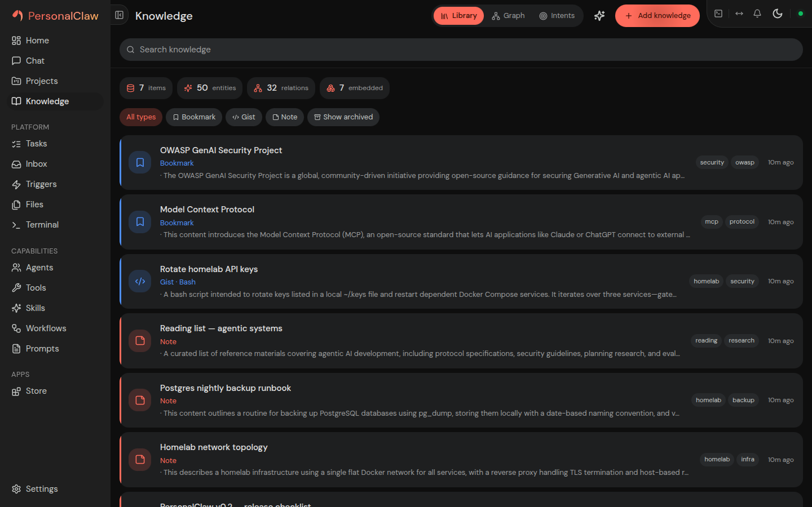
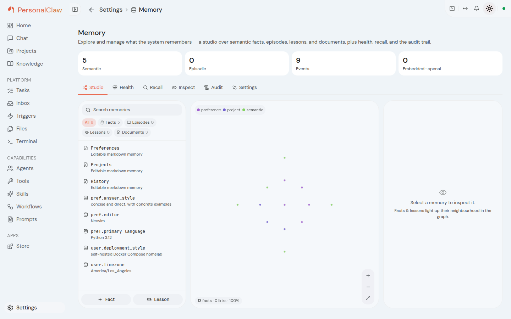

<div align="center">


# PersonalClaw

**A self-hosted personal AI agent — an agentic operating system for one person.**

Chat, autonomous goal loops, long-term memory, a knowledge base, skills, scheduled
automation, and channel integrations — all behind **one gateway process** and **one web
dashboard you own**. Local-first, provider-agnostic, zero telemetry, MIT.

[](https://github.com/PersonalClaw/PersonalClaw/actions/workflows/ci.yml)
[](https://pypi.org/project/personalclaw/)
[](https://github.com/PersonalClaw/PersonalClaw/blob/main/LICENSE)
[](https://github.com/PersonalClaw/PersonalClaw)
[](https://personalclaw.dev)
[](https://personalclaw.dev)

[**Website**](https://personalclaw.dev) · [**Core**](https://github.com/PersonalClaw/PersonalClaw) · [**Apps**](https://github.com/PersonalClaw/PersonalClawApps) · [**Docs**](https://github.com/PersonalClaw/PersonalClaw/blob/main/docs/guides/getting-started.md) · [**Roadmap**](https://github.com/PersonalClaw/PersonalClaw/blob/main/docs/roadmap/roadmap.md)

<br />



<sub><em>The dashboard — one home for tasks, active work, and context-aware suggestions. Dark theme shown; PersonalClaw ships light and dark.</em></sub>

</div>

---

## What is PersonalClaw?

PersonalClaw runs AI agents that accomplish **your** work with a rich, user-assembled set
of capabilities. Every vendor — model providers, search, speech, channels, agent
runtimes — is a **removable app**, so nothing ties you to a single LLM vendor or service.
All state lives under one `~/.personalclaw` home on your machine; the system degrades
gracefully to local-only and never requires the network for core operation.

It is deliberately **single-user and self-hosted**: your conversations, memory, and
knowledge never leave your machine unless *you* wire up a remote provider app. There is
**no telemetry** — not as a setting, but as an architectural choice.



---

## The three repositories

PersonalClaw is one product across three public repos. **Core is the only source of
product truth**; the apps repo follows it, and the website *projects* released core state —
it never advertises ahead of a real release.

| Repository | What it is |
|---|---|
| 🦞 **[PersonalClaw](https://github.com/PersonalClaw/PersonalClaw)** | The **platform** — the gateway, agentic core, memory, knowledge, skills, automation, security, and the permission-gated app platform. Python 3.12 · aiohttp · React + Vite SPA · SQLite. This is where every capability and contract originates. |
| 🧩 **[PersonalClawApps](https://github.com/PersonalClaw/PersonalClawApps)** | The **first-party app bundles** — 38 apps across model providers, search, speech, local models, agents (ACP), channels, tools, and full backend + UI apps. Each imports core **only** through the stable SDK and installs through the same scanner-gated Store as any third-party app. |
| 🌐 **[personalclaw.dev](https://github.com/PersonalClaw/personalclaw.dev)** | The **public website** — product, documentation, security, installation, and ecosystem surface. A zero-tracking, Astro-built projection of *released* PersonalClaw, pinned to exact core + apps revisions so it can never claim something the product can't back. |

---

## Highlights

<table>
<tr>
<td width="50%" valign="top">

### 🗣️ Agentic chat
Multi-session chat with tool use and approval controls, session forking/undo, answer
variants, folders/tags/kanban, side conversations, per-session model overrides, and
temporary/incognito memory modes.

</td>
<td width="50%" valign="top">

### 🎯 Goal loops
Give the agent a target and let it work autonomously — it classifies the goal, plans it,
then loops cycle by cycle under a **deterministic supervisor** you can pause, nudge, or
stop.

</td>
</tr>
<tr>
<td width="50%" valign="top">

### 🧠 Memory that learns
Layered semantic + episodic + procedural memory with active recall, after-turn learning
from your corrections, automatic promotion of repeated facts, and an optional
Obsidian-compatible markdown vault.

</td>
<td width="50%" valign="top">

### 📚 Knowledge base
Ingest documents (PDF/DOCX/PPTX/HTML/…), web pages, and media; AI enrichment, entity
extraction, a knowledge graph, and semantic search wired straight into chat context.

</td>
</tr>
<tr>
<td width="50%" valign="top">

### 🧩 Skills & app platform
Reusable `SKILL.md` procedures plus a permission-gated **Store** where providers,
channels, agent runtimes, and full backend + UI apps install through a
quarantine → scan → consent lifecycle.

</td>
<td width="50%" valign="top">

### ⏰ Automation
Cron / interval / webhook triggers, background subagents, an inbox that watches channels
and drafts replies, and workflow SOPs surfaced automatically when they match.

</td>
</tr>
</table>

### 🛡️ Security-first, by construction
Tool approval modes, a shell-command denylist, an egress guard with allow/deny host
policy, a tamper-evident (HMAC) security event log, app-scoped tokens, and honest labeling
of the one permission it can't technically enforce. Controls are enforced **at the point
of execution**, not merely requested in a prompt — the
[threat model](https://github.com/PersonalClaw/PersonalClaw/blob/main/docs/security/threat-model.md)
maps each to the OWASP Agentic Top-10 with code citations and states the limitations
plainly.

<div align="center">
<table>
<tr>
<td></td>
<td></td>
</tr>
<tr>
<td></td>
<td></td>
</tr>
</table>
<sub><em>Chat · goal loops · knowledge · memory — the full showcase (every screen, light and dark) lives in the <a href="https://github.com/PersonalClaw/PersonalClaw/blob/main/SHOWCASE.md">core repo</a>.</em></sub>
</div>

---

## Quickstart

Install with one command — every path installs the **same release artifact**, and you
don't need to install Python or Node yourself:

```bash
uv tool install personalclaw && personalclaw setup     # recommended — uv brings Python 3.12
```

Or use the bootstrap one-liner (installs `uv` if it's missing, then the above):

```bash
curl -fsSL https://personalclaw.dev/install | sh
```

Then start the gateway and open the dashboard at `http://localhost:10000`:

```bash
personalclaw gateway
```

Install a model-provider app from the Store, add your API key under **Settings →
Providers**, and bind a chat model under **Settings → Models**. Full walkthrough in
[Getting started](https://github.com/PersonalClaw/PersonalClaw/blob/main/docs/guides/getting-started.md).
Also available via **pipx**, **pip** (into an existing Python 3.12+ venv), **Docker
Compose**, or a **git checkout** for development.

<div align="center">

<br />
<sub><em>The Store — 38 first-party apps, each installed through a quarantine → security-scan → consent lifecycle.</em></sub>
</div>

---

## ⚠️ Pre-1.0 — breaking changes expected

PersonalClaw follows a **clean-break** engineering doctrine: when a design is replaced,
the old path is removed in the same change rather than carried behind compatibility shims.
The upshot for early users:

- The next few minor (0.x) releases may introduce **breaking changes with no automatic
  migration** of your existing data under `~/.personalclaw`.
- **Back up before every update** — `personalclaw snapshot` creates a portable archive
  (restore with `personalclaw restore`).
- Treat anything you put in PersonalClaw as reproducible or backed up elsewhere until
  backward-compatibility becomes the default posture (the post-1.0
  [lifecycle doctrine](https://github.com/PersonalClaw/PersonalClaw/blob/main/docs/roadmap/plans/LIFECYCLE-DOCTRINE.md)
  introduces gated, migration-backed changes).

We'd rather tell you plainly now than surprise you on an update.

---

## Ecosystem & building

- **Build an app** — an app is a directory with an `app.json` manifest that imports core
  only via `personalclaw.sdk.*`. Model providers, search, speech, channels, agent
  runtimes, and full backend + UI apps all use the same contract. See the
  [app creation guide](https://github.com/PersonalClaw/PersonalClawApps/blob/main/docs/app-creation-guide.md)
  and [platform architecture](https://github.com/PersonalClaw/PersonalClawApps/blob/main/docs/platform-architecture.md).
- **Contribute to core** — the
  [contributing guide](https://github.com/PersonalClaw/PersonalClaw/blob/main/CONTRIBUTING.md)
  covers the engineering doctrine (clean-break-within-class, provider-agnostic core,
  validate-as-a-user) and dev setup.
- **Supply chain** — releases build in CI from a committed lockfile; PyPI publishing uses
  Trusted Publishing (OIDC) behind a manual approval gate; every release ships a syft SBOM
  and build-provenance attestations.
- **Report a security issue** — privately, via the
  [security policy](https://github.com/PersonalClaw/PersonalClaw/blob/main/SECURITY.md).

---

<div align="center">

**[Get started at personalclaw.dev »](https://personalclaw.dev)**

Open source · self-hosted · zero telemetry · [MIT](https://github.com/PersonalClaw/PersonalClaw/blob/main/LICENSE)

</div>
